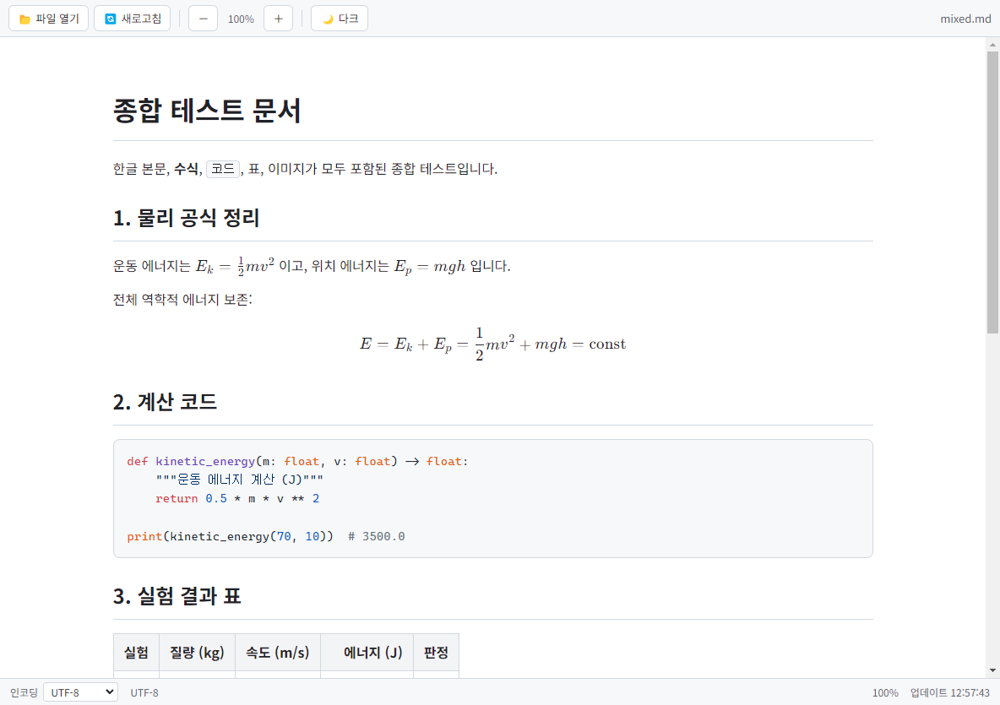
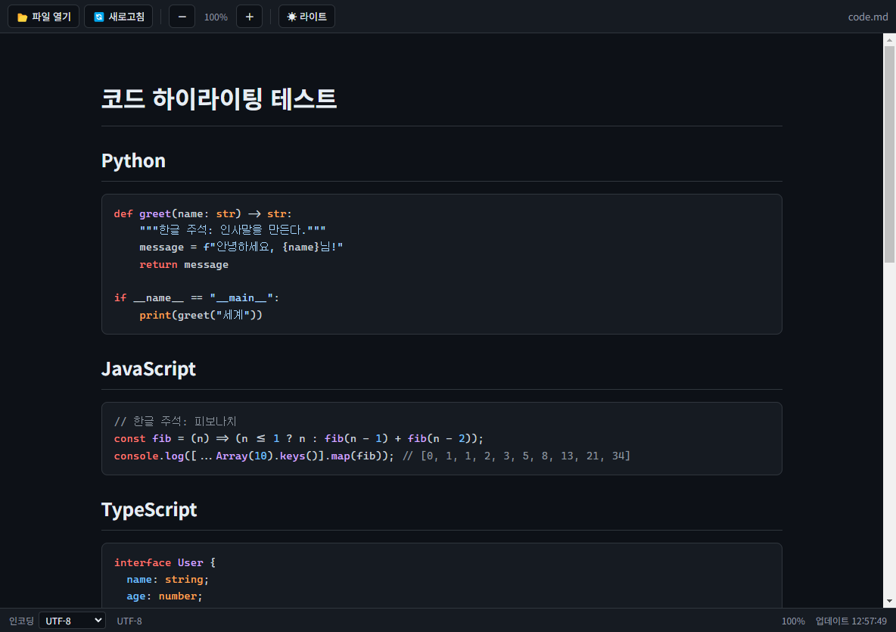
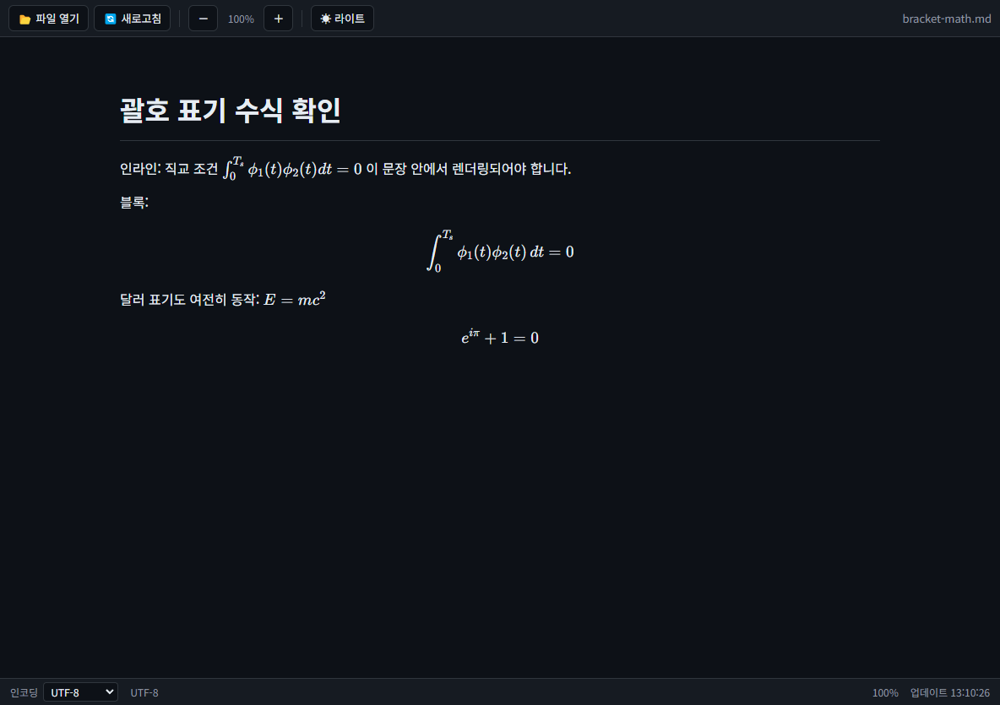
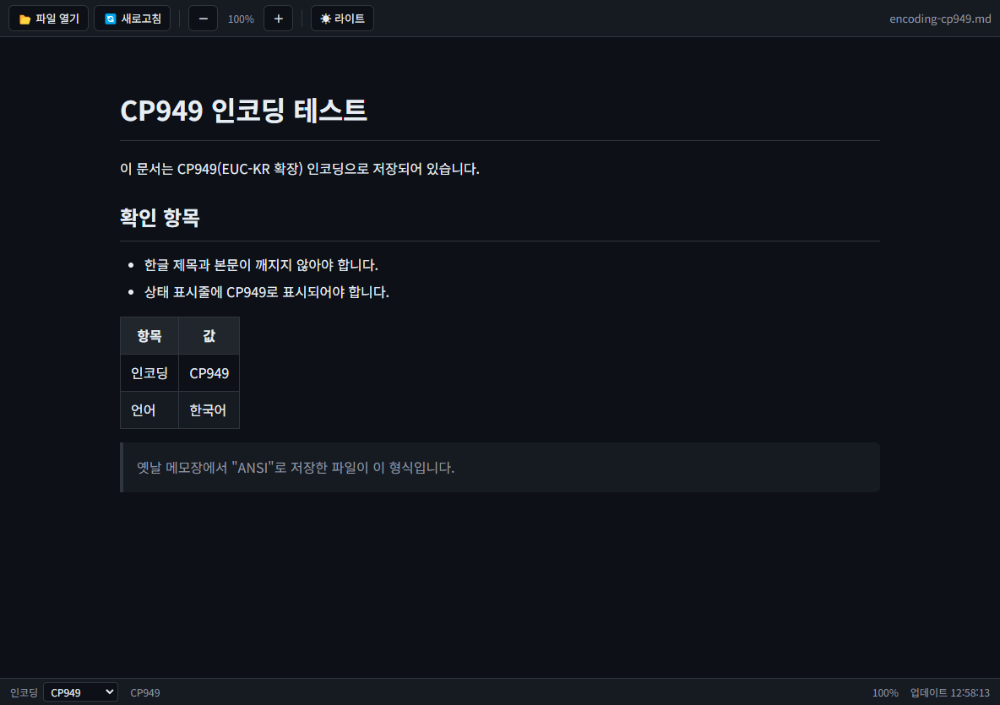

# Markdown Viewer for Windows

Windows에서 동작하는 **한글 친화 Markdown 뷰어**입니다. `.md`, `.markdown`, `.txt` 문서를 열어 한글 본문, GitHub Flavored Markdown(표·체크박스·취소선), LaTeX 수식, 코드 하이라이팅, 로컬 이미지를 정확하게 렌더링합니다. 모든 핵심 기능은 **오프라인**에서 동작합니다.

Electron + TypeScript로 구현했으며, 렌더러 프로세스를 샌드박스로 격리하고 문서 HTML을 sanitize하는 등 보안 설계를 기본으로 합니다. 상세 요구사항 정의서는 [doc/README.md](doc/README.md)에 있습니다.

## 스크린샷

| 라이트 모드 (한글·수식·코드·표) | 다크 모드 (코드 하이라이팅) |
|---|---|
|  |  |

| KaTeX 수식 (`$`, `\(...\)` 표기) | CP949 인코딩 자동 감지 |
|---|---|
|  |  |

## 주요 기능

### 파일 열기

- 파일 열기 대화상자 (`Ctrl+O`), 툴바 버튼
- **드래그 앤 드롭**: Markdown 파일을 창에 끌어다 놓으면 바로 열림
- **최근 파일 목록**: 시작 화면과 `파일 > 최근 파일` 메뉴에서 최대 10개 제공
- 명령행 인자로 파일 전달 가능 (`MarkdownViewer.exe 문서.md`), 설치판은 `.md`/`.markdown` 파일 연결 등록 → 더블클릭으로 열기
- 단일 인스턴스: 앱이 이미 떠 있으면 새 파일이 기존 창에서 열림
- 한글·공백·특수문자가 포함된 경로 지원

### Markdown 렌더링 (markdown-it)

- 제목 `#`~`######`, 굵게/기울임/취소선, 인라인 코드
- 순서 있는/없는 목록과 중첩 목록, 체크박스 목록 `- [ ]` / `- [x]`
- 인용문 `>`, 수평선 `---` `***`, 링크 자동 인식(linkify)
- GitHub Flavored Markdown 표 (정렬 문법 `:---:` 포함)
- HTML 태그 포함 문서는 **DOMPurify로 sanitize 후** 제한적으로 렌더링 — `<script>` 등 위험 요소는 항상 제거
- 잘못된 문법이 있어도 앱이 종료되지 않음

### 수식 렌더링 (KaTeX)

네 가지 표기를 모두 지원하며, KaTeX 스크립트·폰트를 앱에 번들해 오프라인에서 동작합니다.

| 표기 | 용도 | 예시 |
|---|---|---|
| `$...$` | 인라인 | `$E = mc^2$` |
| `$$...$$` | 블록 | `$$\int_{0}^{\infty} e^{-x^2} dx = \frac{\sqrt{\pi}}{2}$$` |
| `\(...\)` | 인라인 (LaTeX 표기) | `\(\int_{0}^{T_s} \phi_1(t) \phi_2(t) dt = 0\)` |
| `\[...\]` | 블록 (LaTeX 표기) | `\[ x = \frac{-b \pm \sqrt{b^2-4ac}}{2a} \]` |

- 분수, 첨자, 적분, 극한, 행렬, 그리스 문자 등 LaTeX 기본 문법 지원
- 한글 문장 중간의 수식도 자연스럽게 표시
- **잘못된 수식이 있어도 전체 렌더링이 실패하지 않고** 해당 위치에 오류가 붉게 표시됨

### 코드 하이라이팅 (highlight.js)

- fenced code block ` ``` ` + 언어 지정 (Python, JavaScript, TypeScript, Bash, C++, JSON 등 주요 언어)
- 코드 블록 위에 마우스를 올리면 **복사 버튼** 표시
- 긴 코드는 블록 내부 가로 스크롤 — 레이아웃이 깨지지 않음
- 라이트/다크 모드에 따라 GitHub 스타일 테마 자동 전환

### 표·이미지

- 한글 표도 열 정렬이 유지되며, 화면보다 넓은 표는 내부 가로 스크롤
- 표 헤더/본문 시각 구분, 짝수 행 배경색
- **로컬 이미지**: Markdown 파일 위치 기준 상대 경로 해석 (`images/a.png`, `./images/a.png`), 절대 경로도 지원
- 한글 파일명 이미지 지원, PNG/JPG/GIF/SVG/WEBP 표시
- 이미지가 없거나 경로가 잘못되면 앱이 멈추지 않고 대체 텍스트 표시

### 한글·인코딩 처리

- 기본 글꼴: Pretendard → Noto Sans KR → 맑은 고딕 순 폴백, 코드는 D2Coding/Consolas
- 한글 문서 기준 줄간격(1.7)과 본문 최대 폭(980px)으로 가독성 확보
- **인코딩 자동 감지**: BOM(UTF-8/UTF-16) → 엄격한 UTF-8 검증 → 실패 시 CP949(EUC-KR 확장) 순서로 판별
- 상태 표시줄에서 인코딩(자동/UTF-8/CP949/EUC-KR/UTF-16 LE)을 직접 선택해 다시 열기 가능
- 감지된 인코딩은 상태 표시줄에 항상 표시

### 테마·보기 옵션

- **라이트/다크 모드** 전환 (`Ctrl+Shift+T` 또는 툴바 버튼) — 수식·코드 색상도 함께 전환
- **글자 확대/축소** 50%~300% (`Ctrl+=` / `Ctrl+-` / `Ctrl+0`, `Ctrl+마우스 휠`)
- 마지막 테마와 배율은 저장되어 다음 실행 시 유지
- 상태 표시줄: 인코딩 | 배율 | 마지막 업데이트 시각

### 자동 새로고침

- 열려 있는 파일이 외부 편집기에서 수정되면 **자동으로 다시 렌더링** (스크롤 위치 유지)
- 수동 새로고침: `F5`, `Ctrl+R`, 툴바 버튼

## 키보드 단축키

| 기능 | 단축키 |
|---|---|
| 파일 열기 | `Ctrl+O` |
| 새로고침 | `F5` 또는 `Ctrl+R` |
| 확대 / 축소 / 기본 크기 | `Ctrl+=` / `Ctrl+-` / `Ctrl+0` (또는 `Ctrl+휠`) |
| 다크/라이트 모드 전환 | `Ctrl+Shift+T` |
| 개발자 도구 | `F12` |
| 종료 | `Ctrl+Q` |

## 다운로드 및 설치 (일반 사용자)

빌드된 실행 파일 두 종류가 제공됩니다 (Windows 10/11 x64).

| 파일 | 설명 |
|---|---|
| `Markdown Viewer Setup <버전>.exe` | NSIS 설치 파일 — 설치 시 `.md`/`.markdown` 파일 연결 등록 |
| `MarkdownViewer-<버전>-portable.exe` | 무설치 포터블 — 더블클릭으로 바로 실행 |

> 코드 서명이 없어 처음 실행 시 Windows SmartScreen 경고가 나올 수 있습니다.
> "추가 정보 → 실행"으로 진행하면 됩니다.

## 개발 환경 (개발자)

### 요구 사항

- [Node.js LTS](https://nodejs.org/) (v22 이상 권장, v24 LTS로 개발/테스트됨)
- Windows 10/11 x64

### 빌드 및 실행

```bash
npm install
```

```bash
npm start
```

`npm start`는 다음을 순서대로 수행한 뒤 앱을 실행합니다.

| 스크립트 | 역할 |
|---|---|
| `npm run build:main` | main/preload TypeScript 컴파일 → `dist/main/` |
| `npm run build:renderer` | renderer를 esbuild로 단일 파일 번들 → `dist/renderer/renderer.js` |
| `npm run build:assets` | index.html, styles.css, KaTeX CSS·폰트, highlight.js 테마 복사 |
| `npm run typecheck` | 전체 소스 타입 검사 (`tsc --noEmit`) |
| `npm run make:testdocs` | CP949 인코딩 테스트 문서 생성 |
| `npm run dist` | 빌드 + electron-builder로 Windows x64 exe 패키징 |

특정 파일을 바로 열면서 실행:

```bash
npx electron . test-docs/mixed.md
```

> **주의**: 클라우드 동기화 가상 드라이브(Google Drive 스트리밍 등) 위에서는 `npm install`이
> 조용히 실패할 수 있습니다. 반드시 로컬 디스크(NTFS) 폴더에서 빌드하세요.

## 테스트

`test-docs/`에 요구사항 검증용 문서가 준비되어 있습니다. 앱에서 하나씩 열어 확인합니다.

| 문서 | 확인 내용 |
|---|---|
| `korean.md` | 한글 제목/본문/목록/표/체크박스/인용문 |
| `math.md` | 인라인·블록 수식, 행렬, `\(...\)` 표기, 잘못된 수식 안전 처리 |
| `code.md` | 언어별 하이라이팅, 복사 버튼, 가로 스크롤 |
| `table.md` | 정렬 표, 긴 표 가로 스크롤, 수식 포함 표 |
| `image-test.md` | 상대 경로·한글 파일명·누락 이미지 처리 |
| `mixed.md` | 한글+수식+코드+표+이미지 종합 |
| `encoding-cp949.md` | CP949 자동 감지 (`npm run make:testdocs`로 생성) |

추가 확인 항목: 테마/배율이 재시작 후 유지되는지, 외부 링크가 기본 브라우저로 열리는지, 문서를 연 채 외부 편집기로 저장하면 자동 갱신되는지.

## Windows exe 패키징

```bash
npm run dist
```

`release/` 폴더에 NSIS 설치 파일과 포터블 exe(x64)가 생성됩니다. 앱 아이콘은 `assets/icon.ico`이며 `scripts/make-icon.js`로 재생성할 수 있습니다.

### 패키징 문제 해결

`Cannot create symbolic link ... libcrypto.dylib` 오류로 실패하는 경우 — electron-builder가 받는
winCodeSign 아카이브의 macOS 심볼릭 링크를 Windows에서 만들지 못해 생기는 알려진 문제입니다.
다음 중 하나로 해결합니다.

1. 캐시를 수동으로 채우기 (시스템 설정 변경 불필요):

```bash
curl -L -o "%TEMP%\winCodeSign-2.6.0.7z" https://github.com/electron-userland/electron-builder-binaries/releases/download/winCodeSign-2.6.0/winCodeSign-2.6.0.7z
node_modules\7zip-bin\win\x64\7za.exe x -y -o"%LOCALAPPDATA%\electron-builder\Cache\winCodeSign\winCodeSign-2.6.0" -xr!darwin "%TEMP%\winCodeSign-2.6.0.7z"
```

2. 또는 Windows **개발자 모드**를 켜서 심볼릭 링크 생성을 허용

## 프로젝트 구조

```text
markdown-viewer/
├─ package.json
├─ tsconfig.json            # 공통 타입 검사 설정
├─ tsconfig.main.json       # main/preload 컴파일 설정
├─ electron-builder.yml     # Windows x64 패키징 설정
├─ doc/README.md            # 요구사항 정의서
├─ docs/screenshots/        # README 스크린샷
├─ scripts/
│  ├─ copy-assets.js        # 렌더러 정적 자산 복사
│  ├─ make-icon.js          # PNG -> ICO 변환
│  └─ make-test-docs.js     # CP949 테스트 문서 생성
├─ src/
│  ├─ main/
│  │  ├─ main.ts            # 창 생성, 메뉴, 파일 열기/감시, 인코딩 감지, IPC
│  │  └─ preload.ts         # contextBridge로 제한된 API 노출
│  ├─ renderer/
│  │  ├─ index.html         # CSP 포함 기본 레이아웃
│  │  ├─ renderer.ts        # UI 로직 (테마/배율/링크/드롭/복사)
│  │  ├─ markdown.ts        # markdown-it + KaTeX + highlight.js + DOMPurify
│  │  └─ styles.css         # 한글 친화 스타일, 라이트/다크 테마
│  └─ common/types.ts       # main <-> renderer 공유 타입
├─ assets/                  # 앱 아이콘
└─ test-docs/               # 테스트 문서 모음
```

## 아키텍처와 보안 설계

```text
┌────────────── main 프로세스 ──────────────┐      ┌──────── renderer (sandbox) ────────┐
│ 파일 대화상자 / fs 읽기 / 인코딩 감지     │ IPC  │ markdown-it → DOMPurify → DOM 반영 │
│ 파일 변경 감시(폴링) / 최근 파일 관리     │◄────►│ KaTeX 수식 / highlight.js 코드     │
│ 메뉴·단축키 / shell.openExternal          │      │ 테마·배율·스크롤 UI 상태           │
└──────────────────────────────────────────┘      └────────────────────────────────────┘
                        ▲ contextBridge (preload.ts) — 최소 API만 노출
```

- `nodeIntegration: false`, `contextIsolation: true`, `sandbox: true` — 렌더러에서 Node API 접근 불가
- 파일 시스템 접근은 전부 main 프로세스에서 수행하고, preload가 `window.mdv`로 **필요한 IPC 함수만** 노출
- 문서 HTML은 렌더링 전에 **DOMPurify로 sanitize** (`<script>`, `<iframe>`, 인라인 이벤트 핸들러 제거)
- `Content-Security-Policy` 메타 태그로 외부 스크립트 실행 차단
- 외부 링크는 앱 내부에서 열리지 않고 `shell.openExternal()`로 기본 브라우저에 위임, 창 내 네비게이션 차단
- 렌더러의 창 열기(`window.open`) 요청은 전부 거부

## 기술 스택

| 구성 요소 | 기술 | 버전 |
|---|---|---|
| 데스크톱 프레임워크 | [Electron](https://www.electronjs.org/) | 33 |
| 언어 | TypeScript | 5.9 |
| Markdown 파서 | [markdown-it](https://github.com/markdown-it/markdown-it) (+ task-lists, texmath) | 14 |
| 수식 | [KaTeX](https://katex.org/) | 0.16 |
| 코드 하이라이팅 | [highlight.js](https://highlightjs.org/) | 11 |
| HTML sanitize | [DOMPurify](https://github.com/cure53/DOMPurify) | 3 |
| 인코딩 변환 | [iconv-lite](https://github.com/ashtuchkin/iconv-lite) | 0.6 |
| 렌더러 번들 | [esbuild](https://esbuild.github.io/) | 0.24 |
| 패키징 | [electron-builder](https://www.electron.build/) | 25 |

## 알려진 제한 사항

- 코드 서명이 없어 첫 실행 시 SmartScreen 경고가 표시될 수 있음
- 50MB를 초과하는 파일은 안전을 위해 열지 않음
- 문서 내 앵커 링크(`#제목`)는 제목에 id가 부여되지 않아 아직 이동하지 않음
- 편집 기능은 없음 (뷰어 전용 — 요구사항 정의서의 향후 확장 항목 참고)

## 라이선스

[MIT License](LICENSE)
